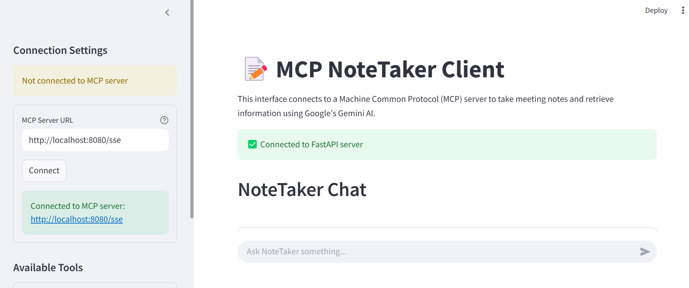

# Model Context Protocol (MCP)

A working demo of MCP integrated with Google's Gemini.

---

## 🚀 Getting Started

### 1. Clone the repository

```bash
git clone https://github.com/drkhan107/mcp_gemini.git
cd your-repo-name
```
### 2. Set up environment variables
Create a .env file in the root directory and add your Google API key:

GOOGLE_API_KEY="your_api_key_here"

### 3. 📦 Install Dependencies
Install all required packages from requirements.txt:

```bash
pip install -r requirements.txt
```

### 4. 🖥️ Run the MCP Server
Start the MCP server:

```bash
python sse_server.py
```
✅ This will start the MCP server at the configured port (default is http://localhost:8080/sse).

### 5. 🧠 Start the MCP Client (Optional)
Once the server is running, start the SSE client with the server URL:

```bash

python ssc_client.py http://localhost:8080/sse
```

### 6. 🧠 Start the FastAPI server (To Use GUI)
Run the following command (To change the port etc, edit the fastapp.py file)

```bash

python fastapp.py
```

### 7. Launch Streamlit app
- Make sure MCP server is running (http://localhost:8080/sse)
- Make sure FastAPI is running.

Run the following command

```bash

streamlit run app.py 
```

This will start the streamlit app on port 8501

### 8. Browser
One you open the browser (localhost:8501), click on connect to MCP server.



✅ Done!
You now have a working demo of the Model Context Protocol with Gemini.

